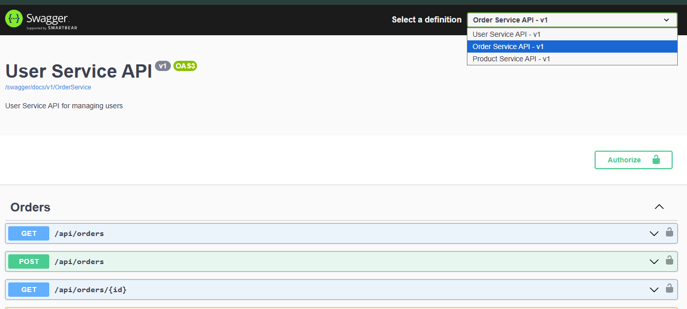

# .NET 8 Microservices with Ocelot Multi-Route API Gateway


A complete microservices solution built with .NET 8, featuring a **centralized Ocelot Multi-Route API Gateway** that provides a unified entry point for multiple microservices. This gateway implements a **multi-route per microservice architecture** where each microservice has its own dedicated route configuration file, enabling independent route management, environment-agnostic routing through placeholder resolution, and fine-grained QoS (Quality of Service) controls per route. The solution includes multiple microservices using Minimal APIs, Docker containerization, Docker Compose orchestration, Health Checks UI dashboard, unified Swagger documentation aggregation, and multi-authentication support with JWT Bearer tokens (Identity service and SSO/OKTA).

## 🎯 What is Multi-Route Gateway?

This solution implements a **centralized API Gateway built with Ocelot** that provides a unified entry point for multiple microservices. The gateway uses a **multi-route per microservice architecture** where each microservice has its own dedicated route configuration file. Instead of managing all routes in a single monolithic `ocelot.json` file, routes are organized into separate files per service (e.g., `ocelot.user.api.json`, `ocelot.order.api.json`, `ocelot.product.api.json`), which are dynamically loaded from a `routes` folder.

### Key Gateway Capabilities:

- **Unified Entry Point**: Single API Gateway (Port 5000) routes requests to multiple microservices
- **Multiple Routes Per Microservice**: Each service can have multiple endpoints configured (GET, POST, PUT, DELETE, etc.)
- **Environment-Agnostic Routing**: Uses placeholder resolution (`{UserService}`, `{OrderService}`) via GlobalHosts configuration for seamless deployment across environments
- **Authentication & Authorization**: Supports multiple JWT Bearer authentication schemes (Identity service and SSO/OKTA) with policy-based authorization per route
- **Response Aggregation**: Can aggregate responses from multiple services (via Swagger aggregation and health check aggregation)
- **Unified Swagger Documentation**: Aggregates Swagger/OpenAPI documentation from all microservices into a single UI with service dropdown selection
- **Health Monitoring**: Health Checks UI dashboard provides real-time monitoring of all services
- **QoS Controls**: Fine-grained Quality of Service settings (timeouts, circuit breakers, retry policies) configurable per route
- **Independent Route Management**: Each microservice team can manage their own route file without affecting others

## 🏗️ Solution Architecture

```
┌─────────────────┐
│  API Gateway    │  (Ocelot - Port 5000)
│   (Gateway)     │
└────────┬────────┘
         │
    ┌────┴────┬──────────┬──────────┐
    │         │          │          │
┌───▼───┐ ┌──▼───┐  ┌───▼───┐  ┌───▼────┐
│ User  │ │Order │  │Product│  │ ...    │
│Service│ │Service│ │Service│  │        │
│ :5001 │ │ :5002│  │ :5003 │  │        │
└───────┘ └──────┘  └───────┘  └────────┘
```

## 📁 Project Structure

```
ocelot-multi-route-gateway/
├── OcelotGateway.sln          # Solution file
├── docker-compose.yml         # Docker Compose configuration
├── .dockerignore              # Docker ignore file
├── README.md                  # This file
└── src/
    ├── Gateway/               # Ocelot API Gateway
    │   ├── Gateway.csproj
    │   ├── Program.cs
    │   ├── appsettings.json
    │   ├── appsettings.Development.json
    │   ├── ocelot.json        # Base Ocelot configuration
    │   ├── routes/            # Multi-route configuration files
    │   │   ├── ocelot.global.json
    │   │   ├── ocelot.user.api.json      # UserService routes
    │   │   ├── ocelot.order.api.json     # OrderService routes
    │   │   ├── ocelot.product.api.json   # ProductService routes
    │   │   └── ocelot.SwaggerEndPoints.json
    │   ├── Extensions/        # Custom extensions
    │   │   ├── AddOcelotRoute.cs
    │   │   ├── AuthenticationExtensions.cs
    │   │   └── ...
    │   └── Dockerfile
    ├── UserService/           # User Management Microservice
    │   ├── UserService.csproj
    │   ├── Program.cs
    │   ├── appsettings.json
    │   └── Dockerfile
    ├── OrderService/          # Order Management Microservice
    │   ├── OrderService.csproj
    │   ├── Program.cs
    │   ├── appsettings.json
    │   └── Dockerfile
    └── ProductService/        # Product Management Microservice
        ├── ProductService.csproj
        ├── Program.cs
        ├── appsettings.json
        └── Dockerfile
```

## 🚀 Features

### Multi-Route Gateway Architecture
- ✅ **Separate route files per microservice** - Each service has its own route configuration file
- ✅ **Dynamic route loading** - Routes are automatically loaded from the `routes` folder at startup
- ✅ **Environment-agnostic routing** - Uses placeholder resolution (`{UserService}`, `{OrderService}`) via GlobalHosts configuration
- ✅ **Centralized service URLs** - Service endpoints managed in `appsettings.json` GlobalHosts section
- ✅ **Hot-reload support** - Route files support reload on change for development
- ✅ **Swagger aggregation per service** - Each service's Swagger documentation is aggregated in the gateway

### Gateway (Ocelot)
- ✅ Centralized routing to microservices
- ✅ Multi-authentication schemes (JWT Bearer - Identity service and SSO/OKTA)
- ✅ Built-in .NET logging (ILogger)
- ✅ Circuit breaker and retry policies (Polly integration)
- ✅ **Health Checks UI Dashboard** - Real-time health monitoring with visual dashboard
- ✅ Health check aggregation for all services
- ✅ Unified Swagger UI for all services
- ✅ CORS support with environment-based configuration
- ✅ Custom pipeline configuration for request/response transformation
- ✅ **QoS (Quality of Service) options per route** - Configurable timeouts, circuit breakers, and retry policies

### Microservices
- ✅ Minimal APIs (.NET 8)
- ✅ CRUD operations for each service
- ✅ Health check endpoints
- ✅ Swagger/OpenAPI documentation
- ✅ In-memory data stores (ready for database integration)

### Infrastructure
- ✅ Docker containerization for all services
- ✅ Docker Compose for orchestration
- ✅ Service-to-service communication via Docker network
- ✅ Environment-based configuration
- ✅ Placeholder-based service discovery

## 🔍 Why Multi-Route Per Microservice?

### 1. **Better Organization & Maintainability**
   - Each microservice team can manage their own route file independently
   - Routes are logically grouped by service, making it easier to find and modify specific routes
   - Reduces merge conflicts when multiple teams work on different services

### 2. **Scalability**
   - As you add more microservices, you simply add a new route file instead of modifying a large monolithic configuration
   - Easier to onboard new services without touching existing route configurations
   - Supports microservices architecture growth without configuration complexity

### 3. **Environment Flexibility**
   - Uses placeholder-based routing (`{UserService}`, `{OrderService}`) that resolves from `GlobalHosts` configuration
   - Same route files work across development, staging, and production environments
   - Service URLs are centralized in `appsettings.json`, making environment-specific deployments easier

### 4. **Independent Deployment**
   - Service teams can update their routes without affecting other services
   - Route changes are isolated to specific service files
   - Reduces risk of breaking changes affecting multiple services

### 5. **Easier Testing & Development**
   - Developers can work on route configurations for their service in isolation
   - Route files can be version controlled independently
   - Easier to review route changes in pull requests

### 6. **Configuration Management**
   - Clear separation of concerns - each service owns its routing configuration
   - Easier to understand which routes belong to which service
   - Better documentation through file naming conventions

### 7. **Reduced Configuration Complexity**
   - Smaller, focused configuration files are easier to understand and maintain
   - Less scrolling through a massive single configuration file
   - Better IDE performance with smaller JSON files

## 📋 Prerequisites

Before you begin, ensure you have the following installed:

- [.NET 8 SDK](https://dotnet.microsoft.com/download/dotnet/8.0)
- [Docker Desktop](https://www.docker.com/products/docker-desktop) (for Windows/Mac) or Docker Engine (for Linux)
- [Docker Compose](https://docs.docker.com/compose/install/) (usually included with Docker Desktop)

## 🛠️ Building the Solution

### Option 1: Using Docker Compose (Recommended)

1. **Clone or navigate to the project directory:**
   ```bash
   cd ocelot-multi-route-gateway
   ```

2. **Build and start all services:**
   ```bash
   docker-compose up --build
   ```

   This will:
   - Build Docker images for all services
   - Start the gateway and all microservices
   - Create a Docker network for service communication

3. **Run in detached mode (background):**
   ```bash
   docker-compose up -d --build
   ```

4. **View logs:**
   ```bash
   docker-compose logs -f
   ```

5. **Stop all services:**
   ```bash
   docker-compose down
   ```

### Option 2: Running Locally (Without Docker)

1. **Restore dependencies:**
   ```bash
   dotnet restore
   ```

2. **Build the solution:**
   ```bash
   dotnet build
   ```

3. **Run services individually:**

   **Terminal 1 - UserService:**
   ```bash
   cd src/UserService
   dotnet run --urls "http://localhost:5001"
   ```

   **Terminal 2 - OrderService:**
   ```bash
   cd src/OrderService
   dotnet run --urls "http://localhost:5002"
   ```

   **Terminal 3 - ProductService:**
   ```bash
   cd src/ProductService
   dotnet run --urls "http://localhost:5003"
   ```

   **Terminal 4 - Gateway:**
   ```bash
   cd src/Gateway
   dotnet run --urls "http://localhost:5000"
   ```

   **Note:** When running locally, the `GlobalHosts` configuration in `appsettings.json` already uses `localhost`. The placeholder resolution (`{UserService}`, etc.) will automatically use these values. No manual route file changes needed!

## 🧪 Testing the Solution

### 1. Health Checks

#### Health Checks UI Dashboard

Access the **Health Checks UI Dashboard** for real-time monitoring:

- **Dashboard URL:** http://localhost:5000/health-ui
- **API Endpoint:** http://localhost:5000/health-ui-api

The dashboard provides:
- ✅ Real-time health status of all services
- ✅ Visual indicators (green/yellow/red) for service health
- ✅ Automatic polling every 10 seconds
- ✅ Health history tracking (last 50 entries per endpoint)
- ✅ Detailed health check information per service
- ✅ Duration and execution time tracking

#### Health Check Endpoints

Check individual service health via API:

```bash
# Gateway health
curl http://localhost:5000/health

# UserService health (through gateway)
curl http://localhost:5000/health/users

# OrderService health (through gateway)
curl http://localhost:5000/health/orders

# ProductService health (through gateway)
curl http://localhost:5000/health/products
```

All health endpoints return JSON in the Health Checks UI-compatible format.

### 2. Swagger Documentation

Access Swagger UI for each service:

- **Gateway (Aggregated):** http://localhost:5000/swagger
- **UserService (Direct):** http://localhost:5001/swagger
- **OrderService (Direct):** http://localhost:5002/swagger
- **ProductService (Direct):** http://localhost:5003/swagger

**Note:** The gateway provides a unified Swagger UI that aggregates all service APIs. Use the dropdown to switch between services.

#### Swagger UI with Microservices Dropdown

The gateway's Swagger UI displays all microservices in a dropdown menu, allowing you to view and test APIs from different services in one place:



*Screenshot showing the Swagger UI with the "Select a definition" dropdown menu displaying:*
- *Order Service API - v1 (currently selected)*
- *User Service API - v1*
- *Product Service API - v1*

*The dropdown allows users to switch between different microservice APIs and view their respective endpoints, schemas, and test the APIs directly from the unified Swagger interface.*

**What the screenshot shows:**

The Swagger UI interface with:
- **Top Right:** "Select a definition" dropdown menu (open/expanded)
- **Available Services:**
  - Order Service API - v1
  - User Service API - v1  
  - Product Service API - v1
- **Main Content Area:** Shows the selected service's API documentation with endpoints, schemas, and an "Authorize" button
- **API Endpoints:** Displayed in collapsible panels showing GET, POST, PUT, DELETE operations for each service

**To capture this screenshot:**
1. Start all services (gateway and microservices)
2. Navigate to http://localhost:5000/swagger
3. Look for the dropdown/select menu at the top of the Swagger UI (usually labeled with service names)
4. Click on the dropdown to see all configured microservices (UserService, OrderService, ProductService)
5. Capture a screenshot showing the dropdown menu with service options visible
6. Save the screenshot as `docs/images/swagger-microservices-dropdown.png`

**📸 Detailed instructions:** See [docs/images/SCREENSHOT_INSTRUCTIONS.md](docs/images/SCREENSHOT_INSTRUCTIONS.md) for step-by-step guidance on capturing the screenshot.

**Note:** If the screenshot file doesn't exist yet, you can add it to the `docs/images/` directory. The image will be displayed here once added.

### 3. API Testing via Gateway

All requests should go through the gateway at `http://localhost:5000`.

#### User Service Endpoints

**Get all users:**
```bash
curl http://localhost:5000/api/users
```

**Get user by ID:**
```bash
curl http://localhost:5000/api/users/1
```

**Create user:**
```bash
curl -X POST http://localhost:5000/api/users \
  -H "Content-Type: application/json" \
  -d "{\"name\":\"Alice Johnson\",\"email\":\"alice@example.com\"}"
```

**Update user:**
```bash
curl -X PUT http://localhost:5000/api/users/1 \
  -H "Content-Type: application/json" \
  -d "{\"id\":1,\"name\":\"John Updated\",\"email\":\"john.updated@example.com\"}"
```

**Delete user:**
```bash
curl -X DELETE http://localhost:5000/api/users/1
```

#### Order Service Endpoints

**Get all orders:**
```bash
curl http://localhost:5000/api/orders
```

**Get order by ID:**
```bash
curl http://localhost:5000/api/orders/1
```

**Get orders by user ID:**
```bash
curl http://localhost:5000/api/orders/user/1
```

**Create order:**
```bash
curl -X POST http://localhost:5000/api/orders \
  -H "Content-Type: application/json" \
  -d "{\"userId\":1,\"productId\":1,\"quantity\":2,\"totalAmount\":199.98,\"status\":\"Pending\"}"
```

**Update order:**
```bash
curl -X PUT http://localhost:5000/api/orders/1 \
  -H "Content-Type: application/json" \
  -d "{\"id\":1,\"userId\":1,\"productId\":1,\"quantity\":3,\"totalAmount\":299.97,\"status\":\"Completed\"}"
```

**Delete order:**
```bash
curl -X DELETE http://localhost:5000/api/orders/1
```

#### Product Service Endpoints

**Get all products:**
```bash
curl http://localhost:5000/api/products
```

**Get product by ID:**
```bash
curl http://localhost:5000/api/products/1
```

**Create product:**
```bash
curl -X POST http://localhost:5000/api/products \
  -H "Content-Type: application/json" \
  -d "{\"name\":\"Wireless Mouse\",\"description\":\"Ergonomic wireless mouse\",\"price\":29.99,\"stock\":150}"
```

**Update product:**
```bash
curl -X PUT http://localhost:5000/api/products/1 \
  -H "Content-Type: application/json" \
  -d "{\"id\":1,\"name\":\"Laptop Pro\",\"description\":\"Updated description\",\"price\":1099.99,\"stock\":30}"
```

**Delete product:**
```bash
curl -X DELETE http://localhost:5000/api/products/1
```

### 4. Using PowerShell (Windows)

**Get all users:**
```powershell
Invoke-RestMethod -Uri "http://localhost:5000/api/users" -Method Get
```

**Create user:**
```powershell
$body = @{
    name = "Bob Smith"
    email = "bob@example.com"
} | ConvertTo-Json

Invoke-RestMethod -Uri "http://localhost:5000/api/users" -Method Post -Body $body -ContentType "application/json"
```

## 🔐 JWT Authentication

The gateway supports **multiple JWT Bearer authentication schemes**:

### Authentication Schemes

1. **Identity Scheme** - JWT tokens from your Identity service
   - Uses symmetric key validation
   - Configured via `JwtSettings` in `appsettings.json`

2. **SSO Scheme** - JWT tokens from OKTA SSO
   - Uses OKTA authority for token validation
   - Configured via `SsoSettings` in `appsettings.json`

### Configuration

**Identity Service JWT Settings** in `src/Gateway/appsettings.json`:
```json
"JwtSettings": {
  "SecretKey": "YourSuperSecretKeyThatShouldBeAtLeast32CharactersLong!",
  "Issuer": "UserService",
  "Audience": "Microservices",
  "ExpirationMinutes": 60
}
```

**SSO/OKTA Settings** in `src/Gateway/appsettings.json`:
```json
"SsoSettings": {
  "Authority": "https://your-okta-domain.okta.com/oauth2/default",
  "Audience": "api://default"
}
```

### Using Authentication

1. **Generate a JWT token** from your Identity service or OKTA
   - Identity service: Use `/api/token/generate` endpoint on UserService
   - OKTA: Use OKTA's token generation flow

2. **Include the token in requests:**
   ```bash
   curl -H "Authorization: Bearer YOUR_JWT_TOKEN" http://localhost:5000/api/users
   ```

3. **Route Configuration**: Routes can specify which authentication scheme to use:
   ```json
   "AuthenticationOptions": {
     "AuthenticationProviderKeys": [ "Identity" ]  // or "SSO"
   }
   ```

**Note:** Authentication is configured per route. Routes with `AuthenticationOptions` will require a valid JWT token from the specified scheme.

## ⚙️ Configuration

### Environment Variables

You can override configuration using environment variables in `docker-compose.yml`:

```yaml
environment:
  - ASPNETCORE_ENVIRONMENT=Development
  - ASPNETCORE_URLS=http://0.0.0.0:5000
```

### Ocelot Configuration

The gateway uses a **multi-route configuration** approach:

#### Base Configuration (`ocelot.json`)
- Contains global settings and base URL configuration
- Located at `src/Gateway/ocelot.json`

#### Service-Specific Route Files (`routes/` folder)
- **`ocelot.user.api.json`** - All routes for UserService
- **`ocelot.order.api.json`** - All routes for OrderService
- **`ocelot.product.api.json`** - All routes for ProductService
- **`ocelot.global.json`** - Global gateway configuration
- **`ocelot.SwaggerEndPoints.json`** - Swagger endpoint aggregation configuration

#### GlobalHosts Configuration (`appsettings.json`)
Routes use placeholders like `{UserService}` that are resolved from the `GlobalHosts` section:

```json
"GlobalHosts": {
  "UserService": "http://localhost:5001",
  "OrderService": "http://localhost:5002",
  "ProductService": "http://localhost:5003"
}
```

This allows:
- **Environment flexibility**: Same route files work in dev/staging/prod
- **Centralized management**: Update service URLs in one place
- **Docker support**: Override via environment variables in `docker-compose.yml`

#### Route File Structure Example
Each route file contains service-specific routes:

```json
{
  "Routes": [
    {
      "DownstreamPathTemplate": "/api/users",
      "DownstreamScheme": "http",
      "DownstreamHostAndPorts": [
        {
          "Host": "{UserService}"  // Resolved from GlobalHosts
        }
      ],
      "UpstreamPathTemplate": "/api/users",
      "UpstreamHttpMethod": [ "GET", "POST" ],
      "SwaggerKey": "UserService",
      "AuthenticationOptions": {
        "AuthenticationProviderKeys": [ "Identity" ]
      }
    }
  ]
}
```

#### Key Configuration Features
- **Routes:** Define upstream and downstream paths per service
- **QoSOptions:** Circuit breaker and timeout settings (configured per route)
  - `ExceptionsAllowedBeforeBreaking`: Number of exceptions before opening circuit
  - `DurationOfBreak`: How long the circuit stays open (ms)
  - `TimeoutValue`: Request timeout (ms)
- **AuthenticationOptions:** JWT Bearer authentication per route (Identity or SSO scheme)
- **SwaggerKey:** Links routes to Swagger documentation aggregation

#### QoS Configuration Example
Each route can have custom QoS settings:

```json
{
  "DownstreamPathTemplate": "/api/users",
  "UpstreamPathTemplate": "/api/users",
  "UpstreamHttpMethod": [ "GET", "POST" ],
  "QoSOptions": {
    "ExceptionsAllowedBeforeBreaking": 3,
    "DurationOfBreak": 1000,
    "TimeoutValue": 5000
  }
}
```

**QoS Settings by Route Type:**
- **API Routes:** Standard QoS (3 exceptions, 1000ms break, 5000ms timeout)
- **Token Routes:** More lenient (5 exceptions, 2000ms break, 3000ms timeout)
- **Health Check Routes:** No circuit breaker (0 exceptions, 0ms break, 2000ms timeout)
- **Swagger Routes:** No circuit breaker (0 exceptions, 0ms break, 3000ms timeout)

### Service Ports

| Service | Port | Description |
|---------|------|-------------|
| Gateway | 5000 | API Gateway entry point |
| UserService | 5001 | User management service |
| OrderService | 5002 | Order management service |
| ProductService | 5003 | Product management service |

## 📊 Logging

The gateway uses the built-in **.NET logging framework** (ILogger):

- **Console output:** Real-time logs in console
- **Structured logging:** Uses .NET's ILogger interface
- **Log levels:** Configurable through `appsettings.json`

Log levels can be configured in `appsettings.json`:
```json
"Logging": {
  "LogLevel": {
    "Default": "Information",
    "Microsoft.AspNetCore": "Warning",
    "Ocelot": "Information"
  }
}
```

The gateway logs important events including:
- Application startup and shutdown
- Route configuration loading
- Health check status
- Error and exception details

## 🔄 Circuit Breaker & Retry Policies (QoS)

The gateway implements **Quality of Service (QoS)** options with circuit breaker and retry policies configured **per route** in the route files. This allows fine-grained control over resilience patterns for different endpoints.

### QoS Configuration

QoS options are configured in each route file (e.g., `ocelot.user.api.json`, `ocelot.order.api.json`). Each route can have different QoS settings based on its requirements:

```json
{
  "Routes": [
    {
      "DownstreamPathTemplate": "/api/users",
      "UpstreamPathTemplate": "/api/users",
      "QoSOptions": {
        "ExceptionsAllowedBeforeBreaking": 3,
        "DurationOfBreak": 1000,
        "TimeoutValue": 5000
      }
    }
  ]
}
```

### QoS Parameters

- **`ExceptionsAllowedBeforeBreaking`**: Number of consecutive exceptions before the circuit breaker opens
  - `0` = Circuit breaker disabled (for critical routes like health checks)
  - `3-5` = Standard for API routes
  - Higher values = More lenient (for token generation, etc.)

- **`DurationOfBreak`**: How long the circuit stays open (in milliseconds)
  - `0` = No circuit breaker
  - `1000-2000` = Standard break duration

- **`TimeoutValue`**: Request timeout in milliseconds
  - `2000-3000` = Fast endpoints (health checks, tokens)
  - `5000` = Standard API endpoints
  - Higher values = Long-running operations

### Default QoS Settings

| Route Type | Exceptions | Break Duration | Timeout |
|------------|-----------|----------------|---------|
| API Routes | 3 | 1000ms | 5000ms |
| Token Routes | 5 | 2000ms | 3000ms |
| Health Checks | 0 (disabled) | 0ms | 2000ms |
| Swagger | 0 (disabled) | 0ms | 3000ms |

### How It Works

1. **Normal Operation**: Requests flow through normally
2. **Exception Threshold**: After the configured number of exceptions, the circuit opens
3. **Circuit Open**: All requests fail immediately without calling the downstream service
4. **Recovery**: After the break duration, the circuit enters a half-open state
5. **Testing**: A test request is allowed through to check if the service recovered
6. **Closed**: If successful, the circuit closes and normal operation resumes

### Benefits

- ✅ **Resilience**: Prevents cascading failures
- ✅ **Performance**: Fast failure for known unhealthy services
- ✅ **Resource Protection**: Reduces load on failing services
- ✅ **Customizable**: Different settings per route type
- ✅ **Automatic Recovery**: Self-healing when services recover

## 🐳 Docker Commands

### Useful Docker Compose Commands

```bash
# Start services
docker-compose up

# Start in background
docker-compose up -d

# Rebuild and start
docker-compose up --build

# Stop services
docker-compose down

# Stop and remove volumes
docker-compose down -v

# View logs
docker-compose logs -f

# View logs for specific service
docker-compose logs -f gateway

# Restart a specific service
docker-compose restart userservice

# Scale a service (if needed)
docker-compose up --scale userservice=2
```

### Individual Docker Commands

```bash
# Build gateway image
docker build -f src/Gateway/Dockerfile -t gateway:latest .

# Run gateway container
docker run -p 5000:5000 gateway:latest

# List running containers
docker ps

# View container logs
docker logs <container-id>

# Execute command in container
docker exec -it <container-id> /bin/bash
```

## 🧩 Adding a New Microservice

Follow these steps to add a new microservice to the gateway:

### Step 1: Create the Service Project

```bash
dotnet new web -n NewService -o src/NewService
```

### Step 2: Implement the Service

1. **Add Minimal API endpoints** in `src/NewService/Program.cs`
2. **Add health checks with UI-compatible format**:
   ```csharp
   using HealthChecks.UI.Client;
   using Microsoft.Extensions.Diagnostics.HealthChecks;
   
   builder.Services.AddHealthChecks();
   
   // In Program.cs, configure health check endpoint:
   app.UseHealthChecks("/health", new Microsoft.AspNetCore.Diagnostics.HealthChecks.HealthCheckOptions
   {
       ResponseWriter = UIResponseWriter.WriteHealthCheckUIResponse
   });
   ```
3. **Add required NuGet package** to `NewService.csproj`:
   ```xml
   <PackageReference Include="AspNetCore.HealthChecks.UI.Client" Version="8.0.1" />
   ```
4. **Configure Swagger** (if not already configured):
   ```csharp
   builder.Services.AddEndpointsApiExplorer();
   builder.Services.AddSwaggerGen();
   ```

### Step 3: Create Dockerfile

Create `src/NewService/Dockerfile` similar to existing services:

```dockerfile
FROM mcr.microsoft.com/dotnet/aspnet:8.0 AS base
WORKDIR /app
EXPOSE 5004

FROM mcr.microsoft.com/dotnet/sdk:8.0 AS build
WORKDIR /src
COPY ["src/NewService/NewService.csproj", "src/NewService/"]
RUN dotnet restore "src/NewService/NewService.csproj"
COPY . .
WORKDIR "/src/src/NewService"
RUN dotnet build "NewService.csproj" -c Release -o /app/build

FROM build AS publish
RUN dotnet publish "NewService.csproj" -c Release -o /app/publish

FROM base AS final
WORKDIR /app
COPY --from=publish /app/publish .
ENTRYPOINT ["dotnet", "NewService.dll"]
```

### Step 4: Add Service to Docker Compose

Add the service to `docker-compose.yml`:

```yaml
newservice:
  build:
    context: .
    dockerfile: src/NewService/Dockerfile
    args:
      BUILD_CONFIGURATION: Release
  container_name: new-service
  ports:
    - "5004:5004"
  environment:
    - ASPNETCORE_ENVIRONMENT=Production
    - ASPNETCORE_URLS=http://0.0.0.0:5004
  networks:
    - microservices-network
  restart: unless-stopped
```

**Update the gateway service** to include the new service in `depends_on`:

```yaml
gateway:
  depends_on:
    - userservice
    - orderservice
    - productservice
    - newservice  # Add this
  environment:
    # ... existing environment variables ...
    - GlobalHosts__NewService=http://newservice:5004  # Add this
```

### Step 5: Create Route Configuration File

Create `src/Gateway/routes/ocelot.newservice.api.json`:

```json
{
  "Routes": [
    {
      "DownstreamPathTemplate": "/swagger/v1/swagger.json",
      "DownstreamScheme": "http",
      "DownstreamHostAndPorts": [
        {
          "Host": "{NewService}"
        }
      ],
      "UpstreamPathTemplate": "/NewService/swagger/v1/swagger.json",
      "UpstreamHttpMethod": [ "GET" ],
      "SwaggerKey": "NewService",
      "QoSOptions": {
        "ExceptionsAllowedBeforeBreaking": 0,
        "DurationOfBreak": 0,
        "TimeoutValue": 3000
      }
    },
    {
      "DownstreamPathTemplate": "/api/newservice",
      "DownstreamScheme": "http",
      "DownstreamHostAndPorts": [
        {
          "Host": "{NewService}"
        }
      ],
      "UpstreamPathTemplate": "/api/newservice",
      "UpstreamHttpMethod": [ "GET", "POST" ],
      "SwaggerKey": "NewService",
      "AuthenticationOptions": {
        "AuthenticationProviderKeys": [ "Identity" ]
      },
      "QoSOptions": {
        "ExceptionsAllowedBeforeBreaking": 3,
        "DurationOfBreak": 1000,
        "TimeoutValue": 5000
      }
    },
    {
      "DownstreamPathTemplate": "/api/newservice/{id}",
      "DownstreamScheme": "http",
      "DownstreamHostAndPorts": [
        {
          "Host": "{NewService}"
        }
      ],
      "UpstreamPathTemplate": "/api/newservice/{id}",
      "UpstreamHttpMethod": [ "GET", "PUT", "DELETE" ],
      "SwaggerKey": "NewService",
      "AuthenticationOptions": {
        "AuthenticationProviderKeys": [ "Identity" ]
      },
      "QoSOptions": {
        "ExceptionsAllowedBeforeBreaking": 3,
        "DurationOfBreak": 1000,
        "TimeoutValue": 5000
      }
    },
    {
      "DownstreamPathTemplate": "/health",
      "DownstreamScheme": "http",
      "DownstreamHostAndPorts": [
        {
          "Host": "{NewService}"
        }
      ],
      "UpstreamPathTemplate": "/health/newservice",
      "UpstreamHttpMethod": [ "GET" ],
      "SwaggerKey": "NewService",
      "QoSOptions": {
        "ExceptionsAllowedBeforeBreaking": 0,
        "DurationOfBreak": 0,
        "TimeoutValue": 2000
      }
    }
  ]
}
```

**Important Notes:**
- Use `{NewService}` as the placeholder for the host (matches the key in GlobalHosts)
- Set `SwaggerKey` to match your service name (used for Swagger aggregation)
- Configure `AuthenticationOptions` as needed for your routes

### Step 6: Update GlobalHosts Configuration

Add the service to `src/Gateway/appsettings.json`:

```json
"GlobalHosts": {
  "UserService": "http://localhost:5001",
  "OrderService": "http://localhost:5002",
  "ProductService": "http://localhost:5003",
  "NewService": "http://localhost:5004"  // Add this
}
```

### Step 7: Add Swagger Endpoint Configuration

Update `src/Gateway/routes/ocelot.SwaggerEndPoints.json`:

```json
{
  "SwaggerEndPoints": [
    // ... existing endpoints ...
    {
      "Key": "NewService",
      "TransformByOcelotConfig": true,
      "Config": [
        {
          "Name": "New Service API",
          "Version": "v1",
          "Url": "http://localhost:5000/NewService/swagger/v1/swagger.json"
        }
      ]
    }
  ]
}
```

### Step 8: Add Health Checks UI Endpoint

Update `src/Gateway/Program.cs` to add the new service to Health Checks UI:

```csharp
builder.Services.AddHealthChecksUI(setup =>
{
    // ... existing endpoints ...
    setup.AddHealthCheckEndpoint("NewService", $"{baseUrl}/health/newservice");
})
.AddInMemoryStorage();
```

### Step 9: Add Project to Solution

```bash
dotnet sln add src/NewService/NewService.csproj
```

### Step 10: Verify Configuration

1. **For local development**, ensure `appsettings.json` has the correct localhost URL
2. **For Docker**, ensure `docker-compose.yml` has the correct service name and port
3. **Route file naming**: Must follow pattern `ocelot.{servicename}.api.json`
4. **GlobalHosts key**: Must match the placeholder used in route files (e.g., `{NewService}`)

### Step 11: Test the Integration

1. **Build and start services:**
   ```bash
   docker-compose up --build
   ```

2. **Verify health check:**
   ```bash
   curl http://localhost:5000/health/newservice
   ```

3. **Check Health Checks UI:**
   - Navigate to http://localhost:5000/health-ui
   - Verify your new service appears in the dashboard with healthy status

4. **Test API endpoint:**
   ```bash
   curl http://localhost:5000/api/newservice
   ```

5. **Check Swagger UI:**
   - Navigate to http://localhost:5000/swagger
   - Verify your new service appears in the Swagger dropdown

### Quick Checklist

- [ ] Service project created with Minimal APIs
- [ ] Health checks configured with UIResponseWriter
- [ ] AspNetCore.HealthChecks.UI.Client package added
- [ ] Dockerfile created
- [ ] Service added to `docker-compose.yml`
- [ ] Route file created with QoS options in `src/Gateway/routes/ocelot.{servicename}.api.json`
- [ ] Service added to `GlobalHosts` in `appsettings.json`
- [ ] Swagger endpoint added to `ocelot.SwaggerEndPoints.json`
- [ ] Health Checks UI endpoint added in `Program.cs`
- [ ] Project added to solution file
- [ ] Gateway `depends_on` updated in `docker-compose.yml`
- [ ] Gateway environment variable added for GlobalHosts
- [ ] Tested locally and in Docker

## 🐛 Troubleshooting

### Services can't communicate

- Ensure all services are on the same Docker network (`microservices-network`)
- Check service names in `ocelot.json` match container names
- Verify ports are correctly mapped

### Gateway returns 404

- Check route files in `src/Gateway/routes/` folder
- Verify the route file follows naming convention: `ocelot.{servicename}.api.json`
- Check `GlobalHosts` configuration in `appsettings.json` matches placeholders in route files
- Verify downstream services are running
- Check service URLs match the configuration
- Ensure route file is being loaded (check gateway startup logs)

### Port already in use

- Change ports in `docker-compose.yml` and `ocelot.json`
- Or stop the service using the port:
  ```bash
  # Windows
  netstat -ano | findstr :5000
  taskkill /PID <PID> /F
  
  # Linux/Mac
  lsof -ti:5000 | xargs kill
  ```

### Docker build fails

- Ensure Docker Desktop is running
- Check Dockerfile paths are correct
- Verify .NET SDK is available in Docker image

## 📚 Next Steps

- [ ] Replace in-memory stores with actual databases (SQL Server, PostgreSQL, MongoDB)
- [ ] Implement JWT token generation endpoint
- [ ] Add API versioning
- [ ] Implement service discovery (Consul, Eureka)
- [ ] Add distributed tracing (OpenTelemetry, Application Insights)
- [ ] Implement rate limiting
- [ ] Add request/response transformation
- [ ] Set up CI/CD pipeline
- [ ] Add unit and integration tests
- [ ] Implement caching (Redis)

## 📖 Resources

- [Ocelot Documentation](https://ocelot.readthedocs.io/)
- [.NET 8 Minimal APIs](https://learn.microsoft.com/en-us/aspnet/core/fundamentals/minimal-apis)
- [Docker Compose Documentation](https://docs.docker.com/compose/)
- [.NET Logging](https://learn.microsoft.com/en-us/dotnet/core/extensions/logging)

## 📝 License

This project is provided as-is for educational and development purposes.

## 🤝 Contributing

Contributions are welcome! Please feel free to submit a Pull Request.

---

**Happy Coding! 🚀**
